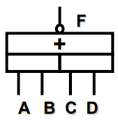
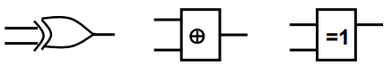

# 逻辑代数基础

## 2.1 基本逻辑运算

三种基本逻辑运算

- 与（AND）$F = A \cdot B$

  

- 或（OR）$F = A + B$

  

- 非（NOT）$F = F'$

  

## 2.2 复合逻辑运算

常用的复合逻辑运算

- 与非（NAND）$F = (AB)'$

  

- 或非（NOR）$F = (A+B)'$

  

- 与或非（AND-OR-NOT）$F= (AB + CD)'$

  

前三个很好理解，顺着读就能明白。“与非”，就是先“与”再“非”。“与或非”，就是 1 与 2 或 3 非。逻辑符号也是由与或非的逻辑符号组合而来的。

- 异或（XOR）：相同为 0，相反为 1： $F = A \oplus B = A'B + AB'$

  

- 同或（XNOR）：相同为 1，相反为 0： $F = A \odot B = A \equiv B = A'B' + AB$

  

## 2.3 逻辑函数表示方法

1. 逻辑表达式
2. 逻辑图
3. 真值表
   - **由真值表可以直接写出两种标准形式的逻辑表达式**
4. 卡诺图

两种标准形式的逻辑表达式

- 标准与或式 (**最小项表达式**: and-or)（乘积之和）表中**输出值为 1**的所有输入取值组合
  - 输入取值组合中：1—原变量  0—反变量
- 标准或与式 (**最大项表达式**: or-and)（和之积）表中**输出值为 0**的所有输入取值组合 
  - 输入取值组合中：0—原变量  1—反变量

例子，真值表：

|  A   |  B   |  C   |  F   |   项   |
| :--: | :--: | :--: | :--: | :----: |
|  0   |  0   |  0   |  0   | A+B+C  |
|  0   |  0   |  1   |  0   | A+B+C' |
|  0   |  1   |  0   |  0   | A+B'+C |
|  0   |  1   |  1   |  1   |  A'BC  |
|  1   |  0   |  0   |  0   | A'+B+C |
|  1   |  0   |  1   |  1   |  AB'C  |
|  1   |  1   |  0   |  1   |  ABC'  |
|  1   |  1   |  1   |  1   |  ABC   |

- 标准或与式：$F = A'BC + AB'C + ABC' + ABC$
- 标准与或式：$F = (A+B+C)(A+B+C')(A+B'+C)(A'+B+C)$

## 2.4 逻辑代数定理及原则

### 2.4.1 公理

$$
\begin{align}
&0 \cdot 0 = 0  &0 + 0 = 0
\end{align}
$$

$$
\begin{align}
&0 \cdot 1 = 1 \cdot 0 = 0 &1 + 0 = 0 + 1 = 1
\end{align}
$$

$$
\begin{align}
&1 \cdot 1 = 1 &1 + 1 = 1
\end{align}
$$

$$
\begin{align}
&0' = 1 &1' = 0
\end{align}
$$

$$
\begin{align}
&\text{if} \, A \ne 0 \, \text{then} A = 1 &\text{if} \, A \ne 1 \, \text{then} A = 0
\end{align}
$$

1 和 3 很清楚

- 两个 0 无论与还是或结果都是 0
- 两个 1 无论与还是或结果都是 1

4 和 5 很简单

- 0 的非是 1，1 的非是 0
- 一个变量，不是 0 就是 1

2 就不用说了

### 2.4.2 基本定理

0-1 律

$$
\begin{align}
&A + 0 = A &A \cdot 0 = 0
\end{align}
$$

$$
\begin{align}
&A + 1 = 1 &A \cdot 1 = 1
\end{align}
$$

互补律

$$
\begin{align}
&A + A' = 1 &A \cdot A' = 0
\end{align}
$$

重叠律

$$
\begin{align}
&A + A' = A &A \cdot A = A
\end{align}
$$

交换律

$$
\begin{align}
&A + B = B + A &A \cdot B = B \cdot A
\end{align}
$$

结合律

$$
\begin{align}
&(A + B) + C = A + (B + C) &(A \cdot B) \cdot C = A \cdot (B \cdot C)
\end{align}
$$

**分配律**：**第二分配律**非常重要
$$
\begin{align}
&A \cdot (B + C) = AB + AC &A + BC = (A + B) \cdot (A + C)
\end{align}
$$

**摩根定理**：符号相反，变量取反
$$
\begin{align}
&(X_1 X_2 \dots X_n)' = X_1' + X_2' + \dots + X_n' &(X_1 + X_2 + \dots + X_n)' = X_1' X_2' \dots X_n'
\end{align}
$$

**对偶规则：**符号相反，变量不变
$$
\begin{align}
&A \cdot (B + C) = AB + AC &A + BC = (A + B) \cdot (A + C)
\end{align}
$$

- 两个逻辑表达式相等，它们的对偶也相等

- 摩根定理 & 对偶规则应用: 表达式化简

### 2.4.3 常用公式

$$
\begin{align}
AB + AB' = A
\end{align}
$$

$$
\begin{align}
A + AB = A
\end{align}
$$

$$
\begin{align}
A + A'B = A + B
\end{align}
$$

$$
\begin{align}
(AB' + A'B)' = A'B' + AB
\end{align}
$$

$$
\begin{equation} \begin{split}
AB + A'C + BC &= AB + A'C \\
AB + A'C+ BCD &= AB+ A'C \\
(A + B)(B + C)(A' + C) &= (A + B)(A' + C)
\end{split} \end{equation}
$$

## 2.5 代数化简法

- 一个逻辑函数有多种不同的表达式（比如可以无尽的取反）

- 同一类型的表达式也不是唯一的（添加冗余项）

最简：

1. 与项（和项）的个数最少

2. 每个与项（和项）中变量的个数最少

使得：

1. 逻辑门的数量最少
2. 逻辑门的输入个数最少

最简意义：降低成本、提高可靠性

化简方法：

- 代数法（再次回忆标题，主要是消去冗余项,还挺难的）

- 卡诺图法

## 3.1 最大项和最小项表达式

*详细见ppt*

- 最大项和最小项概念

- 最大项和最小项表达式

- 最大项和最小项性质

## 3.2 不完全给定函数

- 无关项

  - 不可能存在的输入取值组合

  - 所有的输入取值都存在，但对于某些输入取值，我们并不关心它所对应的输出值是1还是0

- 不完全给定函数—带有无关项的逻辑函数

