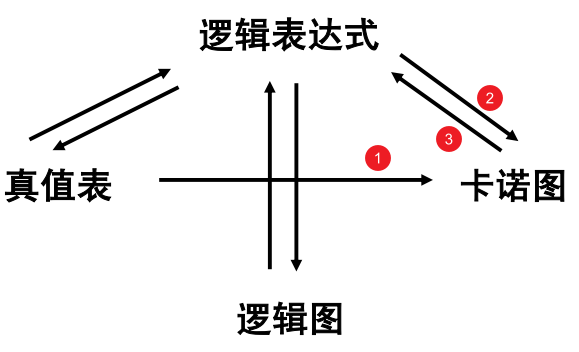

# 卡诺图化简

## 4.1 卡诺图

详细见 ppt

### 4.1.1 多变量卡诺图

- 卡诺图单元格对应的最小项按格雷码摆放

- 任何两个相邻单元格对应的最小项只有一个变量 取值不同

要会写 2~4 变量卡诺图

### 4.1.2 填写卡诺图

1. 从 真值表 到 卡诺图
2. 从 逻辑表达式 到 卡诺图
   1. 标准逻辑表达式——标准与或式/标准或与式
   2. 非标准——化为标准表达式

### 4.1.3 基于卡诺图的逻辑运算

**对应的小方格**进行逻辑运算

## 4.2 卡诺图化简

详细见 ppt

### 4.2.1 从卡诺图中读取 最简与或式（AND-OR）

1. 找圈
   - 将相邻为 1 的小方格圈在一起(小方格的 个数必须为 $2^m$ , m=0,1,2…)
   - 圈里面 1 的个数越多越好
   - 小方格可以重复使用
2. 化圈为**与项**
   - 每个圈代表一个与项
   - 检查每个变量：
     - 变量取值不同—消去
     - 变量取值相同保留：1: 原变量  0: 反变量 
3. 将所有的与项**相加**

### 4.2.2 从卡诺图中读取 最简或与式（OR-AND）

1. 找圈
   - 将相邻为 0 的小方格圈在一起(小方格的 个数必须为 $2^m$ , m=0,1,2…)
   - 圈里面 0 的个数越多越好
   - 小方格可以重复使用
2. 化圈为**和项**：
   - 每个圈代表一个和项
   - 检查每个变量：
     - 变量取值不同—消去
     - 变量取值相同保留：0: 原变量  1: 反变量 
3. 将所有的和项**相乘**

### 4.2.3 从卡诺图中读取 最简与或非式（AND-OR-NOT）

得到 F 的最简与或非式：

1. 先得到 F‘ 的与或式

   - 由 F 的卡诺图 中圈 0 以与或式的读法得到

   - 或者由 F’ 的卡诺图 中圈 1 以与或式的读法得到

2. 对 F‘ 求反

## 4.3 带无关项的卡诺图化简

- 根据需要无关项可“1”可“0”

- 满足圈中“1”（或“0”）的数量最多的前提下，尽量利用无关项

## 4.4 更多变量的卡诺图化简

 展开定理：对逻辑函数降低变量个数