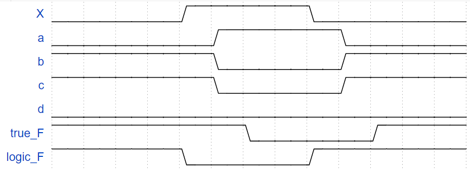

# 组合逻辑电路

## 5.1 门电路的级数

门的级数：电路输入与输出之间**串联**的逻辑门的最大数值

- 二级电路：OR-AND 电路、AND-OR 电路

- 三级电路：OR-AND-OR 电路

二级电路有 8 种基本形式。

设计电路使用与非门、或非门相比与门、或门：

- 速度快

- 性价比高

- 使用的器件种类少

## 5.2 利用单一逻辑门设计两级门电路

真值表 —> 卡诺图 —> 逻辑表达式 —> 逻辑电路

要用单一逻辑门设计两级门电路，就要在逻辑表达式这里变换。

根据卡诺图可以写出最简与或式，但并不是我们想要的。所以我们需要**从最简与或式进行转化**，下面三种转换都是从最简与或式开始的。

### 5.2.1 与非门

Method1：两次取反 + 摩根定理。

Method2：

1. 根据最简与或式画出最简二级与或电路
2. 用与非门替换所有逻辑门
3. 将连接输出门的所有单个变量取反

### 5.2.2 或非门

Method1：对偶 + 两次取反 + 摩根定理 + 对偶。

Method2：

1. 根据**最简或与式**画出**最简二级或与电路**
2. 用**或非门**替换所有逻辑门
3. 将连接输出门的所有单个变量取反

### 5.2.3 与或非门

Method1：两次取反。

Method2：取反 + 合并整理 + 取反

## 5.3 多输出电路的设计

*详细见ppt*

### 5.3.1 代数法

寻找**共享项**，追求**整体最简**

### 5.3.2 卡诺图法

寻找**共享项**，追求**整体最简**

## 5.4 组合逻辑电路设计实例

第五部分学到现在我知道：一个组合逻辑电路可以有多级；可以有多输出；设计的时候用单一逻辑门设计会更好，有办法从最简与或式（逻辑函数）去得到这样的设计；有多个输出的时候还可以找到共享项使得整体的设计最简。

1. 三人表举器设计
2. 举重比赛裁判电路设计
3. 操作码形成器设计
4. 2 位二进制数平方运算电路设计

流程：根据题意设计真值表；画出卡诺图；写出最简与或式；画出逻辑图

## 5.5 几种典型的组合逻辑部件

### 5.5.1 半加器 & 全加器

半加器：对两个1位二进制数执行相加运算

全加器：

对两个4位二进制数的某一位执行相加运算

应用：余三码产生器（4位二进制数 + 0011）

### 5.5.2 串行进位 & 超前进位 —— 并行加法器

串行进位：

- 优点：线路简单

- 缺点：串行进位，运算速度慢

- 关键：进位形成时间

- 解决方案：改串行进位为**并行进位**

并行进位（超前进位）：核心是**进位迭代公式**
$$
P_i = A_i \oplus B_i \\
G_i = Ai B_i \\
C_i = P_i C_{i-1} + G_i
$$

### 5.5.3 三态门

*important！ 一定要看 ppt，是全新的概念。*

### 5.5.4 全减器 & OC 门

全减器的分析和全加器类似。

## 6.0 使用有限扇入逻辑门设计

扇入系数 & 扇出系数

扇入系数：门电路允许的输入端的个数。例如TTL电路的扇入系数通常不超过8。

扇出系数：与非门输出端连接同类门最多个数。反映与非门的带负载能力。

表达式变换：变二级电路为多级电路

1. 提取公因子

2. 与或式 → 或与式

3. 尽量保留或产生共享项

感觉扇的概念和门的概念是相对应的：扇增加了，门电路级数可能下降；想要达成相应的扇出系数，就要对表达式变换，比如把二级电路转化为多级电路。

## 6.1 组合逻辑电路中的险象

一些基本概念

- 门延迟：当输入发生变化，逻辑门的输出不会同步发生改变。

- 竞争：当一个逻辑门的两个输入端的信号同时向相反方向变化， 则该电路存在竞争。 

- 逻辑冒险：逻辑门因输入端的竞争而导致输出了不应有的 尖峰干扰脉冲（又称过渡干扰脉冲）称为冒险。

- 险象的分类：按照输入信号的改变的数量和产生的错误信号脉冲的数量来分类

   - 静态冒险：输入信号发生一次变化只引起一个错误信号脉冲
     - 静态1冒险：理论上是1，但出现了不应有的0
   
     - 静态0冒险：理论上是0，但出现了不应有的1
   
   
   - 动态冒险：输入信号发生一次改变引起多个错误信号脉冲
   
   - 功能冒险：**多个**输入信号的变化不同步而产生的错误信号脉冲

在线画波形图：[WaveDrom Editor](https://wavedrom.com/editor.html)

概念之间的关系

输入信号经过门会产生门延迟，即信号的不同步。后续会因为已经产生的延迟和新的门延迟而产生各种各样的延迟。最后到了输出端的时候可能会产生错误信号脉冲，错误信号脉冲也可以是1个或者多个。

## 6.2 险象的判断及消除

### 6.2.1 险象的判断

1. 代数法：检查表达式中是否存在某个变量X，它同时以原变量和反变量的形式出现；并能在特定条件下简化成 $X + X'$ (静态1冒险) 或者 $X \cdot X'$ (静态0冒险)。
2. 卡诺图法：化简后是否存在**相切**的卡诺圈

### 6.2.2 险象的消除

1. 在切点处添加卡诺圈
2. 添加冗余项
3. 添加吸收电容
4. 加封锁/选通脉冲(FPGA设计中常用)

## 6.3 逻辑电路的测试

情景：给定逻辑函数，给出特定输入下的，有错误输出的逻辑电路图。

总体方向是：从输出端到输入端，逆推。

关注的部分：

1. 看门的功能是否正确。
2. 根据错误不断逆推。直到定位出错误所在。

## 7.0 集成电路的分类

小规模，中规模，超大规模集成电路。

## 7.1 数据选择器

数据选择器/多路开关概念

1. 有 $2^n$ 个数据输入端，$n$ 个选择控制端，$1$ 个输出端。

2. 功能：从多路输入中**选择一个**送往输出端 **($2^n$ 选 $1$)**。

3. 谁决定怎么选：选择哪一路输入送到输出端由**控制信号**决定。

4. 用途：实现多通道的数据传送。

5. 逻辑表达式：

   $$
   Z = \sum_{k=0}^{2^n-1} m_k I_k
   $$
   
   - $m_k$ —— n 个控制变量的最小项
   - $I_k$ —— 第 k 路数据输入

举例

1. 2 选 1 数据选择器 (两路开关)

   $Z = A' I_0 + A I_1$

2. 4 选 1 数据选择器

3. 8 选 1 数据选择器 (二级电路实现/数据选择器级联实现/单一逻辑门实现)

   $Z = A'B'C'I_0 + A'B'CI_1 + A'BC'I_2 + A'BCI_3 + AB'C'I_4 + AB'CI_5 + ABC'I_6 + ABCI_7$

4. 典型芯片：74LS153 (双4选1)

[跳转到7.5 利用数据选择器设计组合逻辑电路](#7.5 利用数据选择器设计组合逻辑电路)

## 7.2 二进制译码器

译码器分类：多输入、多输出的组合逻辑电路。功能：将一种编码转换为另一种编码。

1. 二进制译码器
2. 代码转换译码器
3. 显示译码器

二进制译码器：3线-8线译码器，微处理器的地址译码，3线-8线译码器扩展为 4线-16线译码...

## 7.3 代码转换及显示译码器

1. 代码转换译码器：例：设计一个译码器，将输入的 4 位二进制数转换为格雷码。
2. 显示译码器
   - 与显示器件（如数码管）配合，将输入代码转换为十进制码或特定编码，并在显示器件上显示相应的字形。
   - 例：设计一个 8421 BCD 码驱动的 **共阴极** **七段数码管** 显示译码器，能显示十进制数字 0-9。
   - 典型芯片：74LS47， 74LS48。

## 7.4 编码器

概念

- 特点：多输入、多输出的组合逻辑电路

- 功能：将二进制码按照一定规律编排，使其具有特定含义，**与译码器互逆**。

分类

- 普通编码器  （二进制编码器）：
  - 输入：N 位，任何时刻 N 根输入线中只能有一个输入有效，N（$N = 2^n$）中取一。 
  - 输出：n 位二进制码，每根输出线都与一个输入最小项唯一对应（输出线编号值=最小项编号值）。
  - 实例：键盘编码器
- 优先编码器：允许同时输入两个以上的有效编码输入信号，优先编码器能按照预先设定的优先级级别，只对其中优先级权最高的输入进行编码。
  - 实例：8线-3线优先编码器
  - 典型芯片：74LS148

编码器与译码器的实际应用——计算器

外界输入信息 → 键盘编码器 → 内部进行运算得到运算结果 → 显示译码器 → 在屏幕上显示

## 7.5 利用数据选择器设计组合逻辑电路

1. 回忆[数据选择器](#7.1-数据选择器)是什么。

2. 看一下要解决什么问题。
   - 利用8选1数据选择器设计函数：$F = AB' + A'C + BC'$
   - 利用8选1数据选择器设计函数：$F(A,B,C,D) = \sum m (1,5,6,7,9,11,12,13,14)$
   - 利用4选1数据选择器设计函数：$F(A,B,C,D)= \sum m (0,1,5,6,7,9,10,14,15)$
   - 利用4选1数据选择器设计函数：$F(A,B,C,D,E) = \sum m (0,5,8,9,10,11,17,18,19,20,22,23,28,30,31)$
   - 利用4选1数据选择器设计函数：$F(A,B,C,D) = \sum m (1,2,4,9, 10,11,12,14,15)$
   
   这些最简与或式的电路可以用以前的知识设计，现在一定要使用数据选择器。

3. 分析情况

   数据选择器有 $2^n$ 个数据输入端，$n$ 个选择控制端，$1$ 个输出端；整个组合逻辑电路的输入的变量，也就是数据输入端，其个数为 $m$。故：

   - $m$: 组合电路的输入变量个数
   - $n$: 数据选择器的控制端个数

   很明显的发现数据选择器的 $2^n$ 个数据输入端不能和整个逻辑电路的输入变量个数对应起来，实际上，应该是让**数据选择器的控制端作为整个逻辑电路的输入端**。

   自然的会有 $m = n$ 和 $m > n$ 的情况，前者是刚刚好对应起来，而后者则是有一些组合电路的输入端会在数据选择器的外面列出来。

4. 实现方法

   1. 将逻辑函数描述为最小项之和的形式 $\sum$。
   2. 在 $\sum$ 中包含的所有最小项序号，将对应序号值的数据选择器输入端连接高电平 1，其余输入端连接低电平 0。
   3. $m > n$ 时，利用**降维**的方法将组合电路的输入变量移出去。
      - 此时数据选择器的数据输入端不再是简单的 0 和 1，而是移出的输入变量的组合逻辑函数。
      - 可以从函数的多个输入变量中任意选出若干个作为数据选择器的选择控制变量。但**选择合适**时可使设计简化。
      - 随着降维次数的增多，数据选择器的输入端电路也会变得复杂。
   4. 最后将数据选择器的卡诺图和待设计的组合逻辑的卡诺图对应起来，**对比**画出组合逻辑电路。

## 7.6 利用译码器设计组合逻辑电路

1. 回忆[二进制译码器](#7.2-二进制译码器)是什么。

(译码输出低有效)实现方法

1. 将逻辑函数描述为最小项之和的形式 $\sum$。
2. 若 $\sum$ 中包含最小项 $m_i$，则相同序号值的译码器输出端 $Y_i$ 连接**与非门**的输入端

暂时没看懂。

## 7.7 数码比较器

一种关系运算电路

能对 2 个 n 位二进制数 A 和 B进行比较的多输入、多输出的组合逻辑电路

比较结果：$A > B , A < B, A = B$

## 7.8 奇偶校检器

