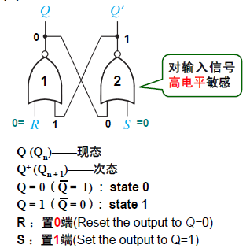
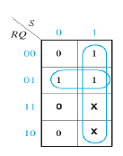
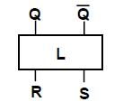
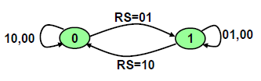

# 或非门构成的基本 RS 锁存器

## 1 电路构成

两个或非门交叉耦合而成。

或非门对输入信号高电平敏感：因为只要有一个输入端的信号为高电平，输出端一定为低电平。

## 2 功能表

- 时序电路当前时刻的状态是什么？
- 在输入信号的作用下，下一时刻的状态是什么？

| 置 0 端 R | 置 1 端 S | 现态 $Q_n$ | 次态 $Q_{n+1}$ |
| :-------: | :-------: | :--------: | :------------: |
|   **0**   |   **0**   |   **0**    |     **0**      |
|     0     |     0     |     1      |       1        |
|     0     |     1     |     0      |       1        |
|     0     |     1     |     1      |       1        |
|     1     |     0     |     0      |       0        |
|     1     |     0     |     1      |       0        |
|     1     |     1     |     0      |       --       |
|     1     |     1     |     1      |       --       |

具体分析第一行：现态为 0 态；输入信号同时送 0，经过耦合的或非门我们发现 $Q$ 和 $Q'$ 的状态并不发生改变。也就是说，这样的输入信号对于这个电路而言是不敏感信号，所以次态并未改变。

同理分析第二行：和第一行一样，次态也不会发生改变，次态和现态是相同的。我们称之为**保持**功能。从另一个角度分析，因为或非门对输入信号高电平敏感，所以这样的输入信号对这个逻辑电路而言是无效的刺激信号。

具体分析第五行：R 端送 1，S 端送 0；那么一号或非门的输出端必定为 0，即 $Q =  0$，并且这个信号将反馈到二号或非门，与 $S = 0$ 同时作用，使得 $Q' = 1$。

同理分析第六行：和第五行一样，当 R 端送 1，S 端送 0 时，无论现态如何，次态都会变为 0，我们称其为**置 0**功能。

同理分析第三，四行：当 R 端送 0，S 端送 1 时，无论现态如何，次态都会变为 1，我们称其为**置 1**功能。

最后分析第七，八行：R 端和 S 端同时送 1 是不允许的。因为这样会使得 $Q$ 和 $Q'$ 都变为 0，这样违背了双稳态触发器的特点。这就是输入约束，RS 对同时取 1 互斥。

### 简化功能表

| 置 0 端 R | 置 1 端 S | 次态 $Q_{n+1}$ | 功能 |
| :-------: | :-------: | :------------: | :--: |
|     0     |     0     |     $Q_n$      | 保持 |
|     0     |     1     |       1        | 置 1 |
|     1     |     0     |       0        | 置 0 |
|     1     |     1     |       --       | 约束 |

## 3 次态方程

功能表和真值表很相像。根据功能表可以画出对应的卡诺图，进而写出次态方程。

$$
Q_{n+1} = S + \bar R Q_n \\
SR = 0 (\text{约束条件})
$$

## 4 逻辑符号

## 5 驱动表

完成状态转换需要满足的输入条件，用于时序电路的设计。

对于一个触发器，我们从外界来看，当前时刻的状态是什么，下一时刻的状态又是什么。

显然现在状态转换的情况只有四种。

我们考察出现这样的状态转换所需要的输入信号。

| $Q_n -> Q_{n+1}$ |  R   |  S   |
| :--------------: | :--: | :--: |
|      0 -> 0      |  X   |  0   |
|      0 -> 1      |  0   |  1   |
|      1 -> 0      |  1   |  0   |
|      1 -> 1      |  0   |  X   |

具体分析第一行：从 0 到 0，可以由保持功能实现，也可以由置 0 功能实现；这两个功能对 RS 的要求是 00 和 10，合起来就是 X0，也就是说只要 $S = 0$ 就可以实现。

## 6 状态图

反映时序电路状态转移规律及相应输入、输出取值关系的有向图。

图中元素的含义

- 圆圈：表示电路的状态
- 有向线段：表示状态的转换关系
- 有向线段旁的文字：表示转换条件，即输入信号取值
