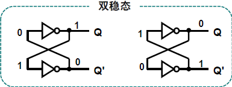

# 触发器

## 8.0 时序电路的特点

### 8.0.1 时序电路的特点（与组合电路相比）

- 电路的输出与以下均有关
  - 当前时刻的输入
  - 电路过去（上一个时刻）的工作状态
- 包含存储元件（存储电路）
  - 锁存器（*Latche*）和触发器（*flip-flop*）是构成存储电路的基本元件
- 现态（原态）和次态（新态）
  - 现态：存储电路当前时刻的状态 $Q(Q_n)$
  - 次态：存储电路下一时刻的状态 $Q^+(Q_{n+1})$
- 逻辑函数表达式有三组：输出方程，驱动方程，状态方程.

### 8.0.2 **双稳态**触发器的特点

1. 有两个互补的输出端 $Q$ 和 $Q'$
2. 有两个**稳定的状态**：（指输出端）
   - $0$ 态 $Q = 0$
   - $1$ 态 $Q = 1$
3. 在外界信号的刺激下，可以从一个稳定状态转变到另一个稳定状态
4. 记忆功能：没有（或无效的）外界信号刺激，维持当前状态不变

实例分析：

左图：若 $Q = 1$，则经过下面反相器的反馈使得 $Q' = 0$，同时 $Q' = 0$ 的信号经过上面的反相器的反馈加强了 $Q = 1$ 的信号。

右图：若 $Q = 0$，则经过下面反相器的反馈使得 $Q' = 1$，同时 $Q' = 1$ 的信号经过上面的反相器的反馈加强了 $Q = 0$ 的信号。

每个锁存器（触发器）可以存放 $1$ 位二进制数

- 触发器：有时钟输入端，并且**只在时钟信号到来时，才发生状态转换**
- 锁存器：没有时钟输入端，很多时候有使能端

## 8.1 锁存器

### 8.1.1 基本 RS 锁存器

**学习分析流程**

1. 电路构成 & 逻辑符号
2. 功能表 -> 卡诺图 -> 次态方程（对应真值表 -> 卡诺图 -> 逻辑表达式）
3. 驱动表和状态图
   - 驱动表：完成状态转换需要满足的输入条件
   - 状态图：反映时序电路状态转移规律及相应输入、输出取值关系的有向图

基本 RS 锁存器是众多触发器的鼻祖，其余的触发器都是在它的基础上逐步改进和完善后形成的

- 或非门构成的基本 RS 锁存器（对输入信号高电平敏感）
- 与非门构成的基本 RS 锁存器（对输入信号低电平敏感）

分析实例：[或非门构成的基本RS锁存器](part5/或非门构成的基本RS锁存器.md)

锁存器的应用—开关去颤

基本 RS 锁存器总结

- 优点：结构简单
- 缺点：
  1. 输入存在约束，使用不便
  2. 状态改变由输入直接控制，容易引发错误
- 用途：记忆输入状态

### 8.1.2 门控 D 锁存器

- 特点：结构简单，仅一个输入端，不存在输入约束问题。
- 缺点：使能电位 G 作用期间，只要输入信号 D 改变(有时是干扰信号），Q 也跟着改变；存在“空翻”现象

空翻：

- 一个时钟内，触发器状态发生多次变化
- “空翻”现象是锁存器（或电平方式触发器）共有的问题
- “空翻”使以上器件不能正确实现计数功能！

## 8.2 边沿触发器

时钟触发器

- 受时钟脉冲(用 CP 或 CK 表示)控制的触发器称作时钟触发器。
- 时钟也称同步信号。将多个触发器的时钟端相连，可以控制它们同一时刻动作。
- 触发方式有电平触发和边沿触发两种。
  - 电平触发方式：时钟信号高电平期间，触发器可以做状态翻转
  - 边沿触发方式：时钟上升沿到来时刻，触发器可以做状态翻转

时钟边沿触发器

- 何时转换？——时钟脉冲有效边沿到来时刻，其余时刻都是保持功能
- 如何转换？——输入信号取值确定，由输入信号确定触发器状态转换的方向

## 8.3 带附加输入端的边沿触发器

## 8.4 触发器类型转换

## 8.5 触发器的应用

## 8.6 实际应用电路——输入输出电路